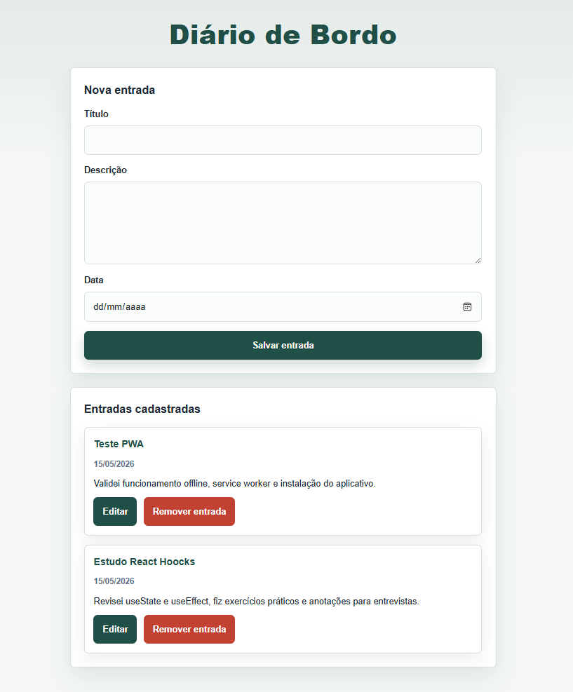
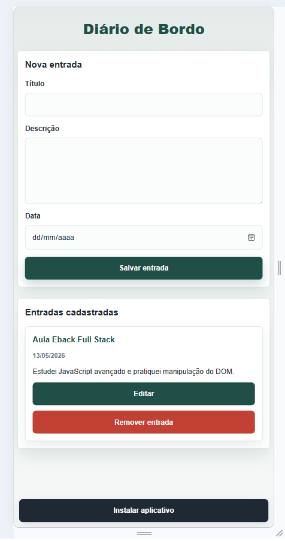

# Diário de Bordo


> Progressive Web App para registro de atividades diárias, com persistência local, funcionamento offline e suporte à instalação no dispositivo.

---

## Descrição do Projeto

O **Diário de Bordo** é um aplicativo frontend desenvolvido como **Progressive Web App (PWA)** para registrar atividades, anotações e acontecimentos do dia a dia de forma simples, rápida e acessível.

O projeto foi construído com **HTML5, CSS3 e JavaScript puro**, priorizando fundamentos da web moderna, organização de código, responsividade, persistência no navegador e experiência offline por meio de **Service Worker** e **Web App Manifest**.

A aplicação permite cadastrar entradas com título, descrição e data, listar registros dinamicamente, editar ou remover itens e manter os dados salvos no navegador usando `localStorage`.

---

## Demonstração

### Área de trabalho



### Móvel



---

## Sobre o Projeto

Este projeto tem como objetivo demonstrar uma base sólida de desenvolvimento frontend sem dependências externas, explorando recursos nativos do navegador para criar uma experiência próxima a um aplicativo instalado.

Do ponto de vista técnico e arquitetural, o projeto foi pensado para evidenciar:

- Estrutura HTML semântica e acessível.
- Estilização moderna com CSS puro e variáveis reutilizáveis.
- Manipulação do DOM com JavaScript organizado em funções.
- Persistência local com `localStorage`.
- Funcionamento offline com estratégia simples de cache.
- Instalação como PWA usando `manifest.json`, `service-worker.js` e `beforeinstallprompt`.
- Separação clara entre estrutura, apresentação e comportamento.

---

## Arquitetura e Organização

O projeto segue uma arquitetura frontend simples, direta e profissional, separando as responsabilidades principais em arquivos independentes.

| Camada | Arquivo | Responsabilidade |
| --- | --- | --- |
| Estrutura | `index.html` | Define a estrutura semântica da aplicação, formulário, lista de entradas, imports e metadados PWA. |
| Apresentação | `estilo.css` | Centraliza a identidade visual, responsividade, variáveis CSS, cards, botões e estados interativos. |
| Comportamento | `script.js` | Controla formulário, validação, CRUD local, `localStorage`, renderização dinâmica e instalação PWA. |
| PWA Manifest | `manifest.json` | Descreve nome, ícones, cores, modo de exibição e configurações de instalação do app. |
| Offline | `service-worker.js` | Gerencia cache dos arquivos principais e permite uso offline. |
| Assets | `icons/` | Armazena ícones utilizados pelo manifest para reconhecimento e instalação do PWA. |

### Decisões Arquiteturais

- **HTML, CSS e JS separados:** facilita manutenção, leitura e evolução do projeto.
- **CSS com variáveis:** torna cores, espaçamentos e sombras mais consistentes.
- **JavaScript funcional e organizado:** cada função tem uma responsabilidade clara.
- **Cache offline simples:** adequado ao escopo de uma aplicação estática.
- **Manifest dedicado:** permite que navegadores identifiquem o app como instalável.

---

## Estrutura de Pastas

```txt
diario-de-bordo/
├── icons/
│   ├── icon-192.png
│   └── icon-512.png
├── estilo.css
├── index.html
├── manifest.json
├── README.md
├── script.js
└── service-worker.js
```

---

## Responsabilidade de Cada Arquivo

### `index.html`

Arquivo principal da aplicação. Define a estrutura HTML5, incluindo cabeçalho, formulário de cadastro, botão de instalação PWA, área de listagem das entradas, importação de estilos, script, manifest e meta tag `theme-color`.

### `estilo.css`

Arquivo responsável pela interface visual. Contém variáveis CSS, layout centralizado, formulário estilizado, cards de entradas, botões, sombras, estados de foco, hover suave e ajustes responsivos para desktop e mobile.

### `script.js`

Arquivo responsável pela regra de interação da aplicação. Captura dados do formulário, valida campos, cria entradas, renderiza a lista, remove registros, salva e carrega dados do `localStorage`, registra o Service Worker e controla o fluxo de instalação do PWA.

### `manifest.json`

Arquivo de configuração do Web App Manifest. Informa ao navegador o nome da aplicação, nome curto, URL inicial, modo de exibição, cores do app e ícones utilizados durante a instalação.

### `service-worker.js`

Arquivo responsável pelo funcionamento offline. Durante a instalação do Service Worker, os principais arquivos estáticos são armazenados em cache. Em requisições futuras, a aplicação tenta responder usando o cache e aplica fallback para navegação offline.

### `icons/`

Pasta dedicada aos ícones do PWA. Os arquivos `icon-192.png` e `icon-512.png` são referenciados pelo manifest e utilizados pelo navegador em atalhos, telas de instalação e exibição do aplicativo.

---

## Princípios Aplicados

| Princípio | Aplicação no projeto |
| --- | --- |
| Separação de responsabilidades | HTML, CSS, JS, manifest e service worker possuem papéis independentes. |
| Código limpo | Funções pequenas, nomes descritivos e estrutura previsível. |
| Organização modular | Cada recurso principal fica em um arquivo dedicado. |
| Responsividade | Layout adaptado para telas pequenas e grandes. |
| Offline first | Arquivos essenciais são cacheados para uso sem conexão. |
| Acessibilidade básica | Uso de labels, estrutura semântica e estados de foco visíveis. |

---

## Tecnologias e Justificativas

- HTML5
- CSS3
- JavaScript
- LocalStorage
- PWA
- Service Worker

---

## Funcionalidades

- ✔ Criar entradas
- ✔ Editar entradas
- ✔ Remover entradas
- ✔ Persistência com localStorage
- ✔ Funcionamento offline
- ✔ Instalação como PWA
- ✔ Service Worker
- ✔ Responsividade

---

## Habilidades Demonstradas

Este projeto demonstra competências importantes em desenvolvimento frontend moderno:

- Manipulação do DOM com JavaScript puro.
- Criação dinâmica de componentes de interface.
- Persistência de dados no navegador com `localStorage`.
- Registro e uso de Service Worker.
- Implementação de cache offline.
- Configuração de Web App Manifest.
- Controle do fluxo de instalação PWA com `beforeinstallprompt`.
- Organização de projeto frontend sem frameworks.
- Responsividade com CSS puro.
- Uso de variáveis CSS e design consistente.
- Estrutura HTML semântica.

---

## Aprendizados

Durante o desenvolvimento do Diário de Bordo, foram praticados conceitos essenciais de frontend moderno, incluindo manipulação do DOM para criar e atualizar elementos dinamicamente, persistência local com `localStorage`, configuração de PWA com manifest e instalação, uso de Service Worker para cache offline e construção de uma interface responsiva para desktop e mobile.

---

## Como Executar Localmente

Para testar a aplicação corretamente, use um servidor local. Isso é importante porque **Service Workers não funcionam ao abrir o arquivo diretamente pelo protocolo `file://`**.

Instale as dependências do projeto:

```bash
npm install
```

Inicie o servidor estático:

```bash
npm run dev
```

Depois, acesse:

```txt
http://localhost:3000
```

---

## Como Testar o PWA

### Lighthouse

1. Abra a aplicação no Google Chrome.
2. Acesse as DevTools.
3. Abra a aba **Lighthouse**.
4. Selecione a categoria **Progressive Web App**.
5. Execute a auditoria.

### Instalação

1. Execute a aplicação em `localhost` ou em ambiente HTTPS.
2. Aguarde o navegador disponibilizar o evento de instalação.
3. Clique no botão **Instalar aplicativo**, quando ele aparecer.
4. Confirme a instalação no prompt do navegador.

### Modo Offline

1. Abra a aplicação em um servidor local.
2. Acesse a aplicação ao menos uma vez para registrar o Service Worker.
3. Abra as DevTools.
4. Na aba **Application**, confirme o Service Worker ativo.
5. Ative o modo offline na aba **Network**.
6. Recarregue a página e valide que os arquivos principais continuam acessíveis.

---

## Estrutura PWA Implementada

| Recurso | Implementação |
| --- | --- |
| Manifest | `manifest.json` com nome, short name, cores, modo standalone, start URL e ícones. |
| Service Worker | `service-worker.js` registra cache dos arquivos principais e limpa caches antigos. |
| Cache offline | Arquivos essenciais são armazenados para acesso sem conexão. |
| Instalação | `beforeinstallprompt` controla a exibição do botão de instalação. |
| Ícones | `icons/icon-192.png` e `icons/icon-512.png` preparados para o manifest. |
| Tema | `theme_color` e meta `theme-color` alinhados para integração visual com o navegador. |

---

## Melhorias Futuras

- Migrar persistência de `localStorage` para **IndexedDB** para suportar volumes maiores de dados.
- Adicionar autenticação para perfis individuais.
- Implementar sincronização em nuvem.
- Criar notificações push para lembretes.
- Adicionar categorias ou tags para organizar entradas.
- Incluir filtros por data, título ou categoria.
- Adicionar exportação de registros em JSON ou CSV.
- Melhorar estratégia de cache com atualização em segundo plano.
- Adicionar testes automatizados para funções principais.

---

## Status do Projeto

🚀 Projeto funcional em versão inicial, com base PWA implementada e preparado para evoluções futuras.

---

## Contato

**Luana Groth**

Desenvolvedora Full Stack em formação, focada em desenvolvimento web e construção de aplicações modernas.

- **GitHub:** <https://github.com/Luanagroth>
- **LinkedIn:** <https://www.linkedin.com/in/luanagroth/>
- **Portfólio:** <https://luana-groth-portfolio.vercel.app>
