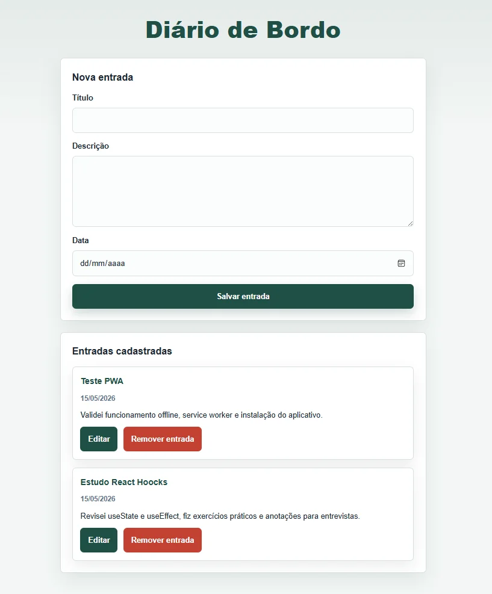
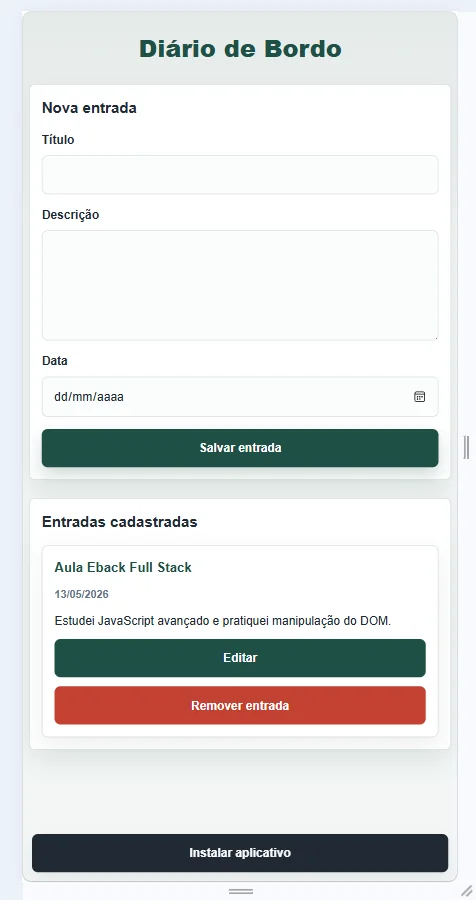
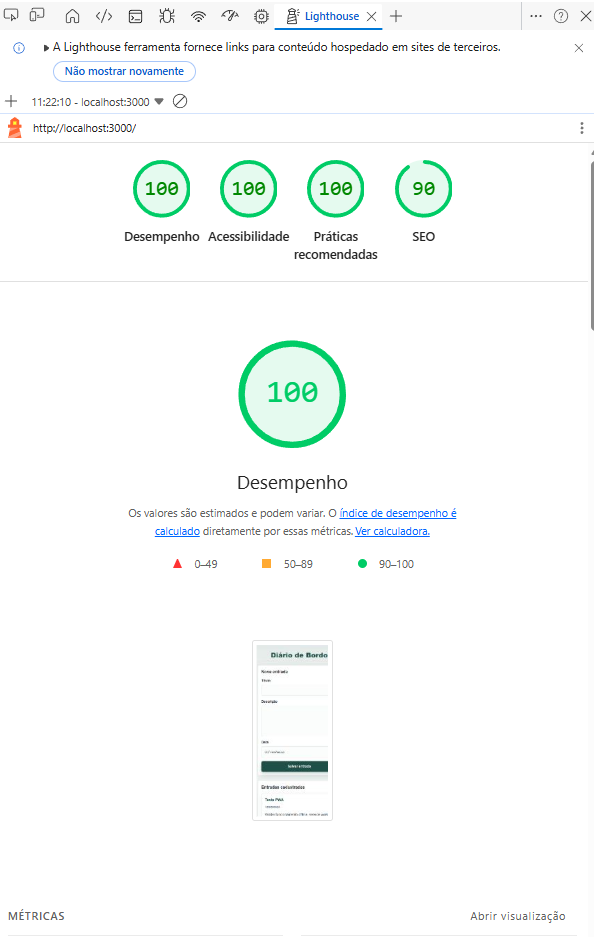
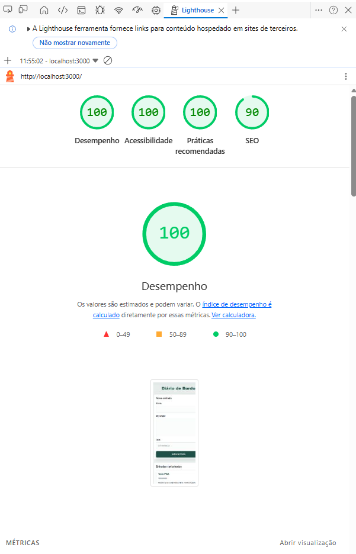

# Diário de Bordo — Versão Performance


O **Diário de Bordo — Versão Performance** é a segunda versão do aplicativo **Diário de Bordo**, criada com foco em estudo, análise técnica e otimização de performance web.

> Esta é uma evolução técnica do projeto original, criada para estudo prático de performance web, otimização incremental e análise de métricas utilizando Lighthouse e Chrome DevTools.

A **primeira versão** foi desenvolvida como um **Progressive Web App (PWA)** para registro de atividades diárias, com CRUD local, persistência em `localStorage`, funcionamento offline e suporte à instalação no dispositivo.

Esta **segunda versão** parte da aplicação original e evolui o projeto para um contexto mais técnico: investigação de gargalos, auditoria com **Lighthouse**, análise com **Chrome DevTools**, ajustes no **Service Worker**, otimização de assets, minificação de arquivos e comparação dos resultados antes/depois.

O objetivo não foi reconstruir a interface do zero, mas sim demonstrar como uma aplicação funcional pode ser medida, analisada e otimizada de forma incremental, mantendo sua proposta original e melhorando sua base técnica para futuras evoluções.

---

## Sobre esta versão

Esta versão foi criada a partir da aplicação original e evoluída com foco em **análise e otimização de performance**.

O estudo teve como objetivos:

- Identificar gargalos técnicos na entrega dos arquivos estáticos.
- Analisar métricas e comportamento da aplicação com Lighthouse e DevTools.
- Aplicar otimizações reais sem descaracterizar o projeto original.
- Comparar resultados antes/depois das melhorias.
- Documentar o impacto técnico das alterações realizadas.

Foram estudados pontos como estratégia de cache, atualização de arquivos offline, minificação, formatos modernos de imagem, remoção de duplicidades, estrutura de build e leitura crítica dos relatórios de performance.

---

## Demonstração

### Desktop



### Mobile



---

## Comparação entre versões

| Recurso | Versão Original | Versão Performance |
|----------|----------------|-------------------|
| PWA | ✔ | ✔ |
| LocalStorage | ✔ | ✔ |
| CRUD | ✔ | ✔ |
| Funcionamento Offline | ✔ | ✔ |
| Minificação | ❌ | ✔ |
| Build automatizado | ❌ | ✔ |
| Screenshots otimizados | ❌ | ✔ |
| Estratégia avançada de cache | ❌ | ✔ |
| Relatórios Lighthouse | ❌ | ✔ |

---

## Funcionalidades

- Criar entradas de diário com título, descrição e data.
- Editar entradas já cadastradas.
- Remover registros.
- Listar entradas dinamicamente na interface.
- Persistir dados no navegador usando `localStorage`.
- Funcionar offline após o carregamento inicial.
- Permitir instalação como PWA.
- Manter layout responsivo para desktop e mobile.

---

## Gargalos identificados

Durante a análise da aplicação original, foram identificados pontos com potencial de melhoria:

- Redundância no cache do Service Worker.
- Risco de conteúdo obsoleto usando estratégia `cache-first`.
- Ausência de minificação dos arquivos CSS e JavaScript.
- Screenshots sem uso de formatos modernos.
- Arquivos duplicados no projeto.

Esses pontos não impediam o funcionamento da aplicação, mas afetavam a qualidade da entrega técnica, a manutenção do cache e a preparação do projeto para evolução.

---

## Melhorias aplicadas

### Service Worker

O `service-worker.js` foi ajustado para uma estratégia mais consistente de cache e atualização:

- Uso de `CACHE_NAME` versionado como `diario-de-bordo-v3`.
- Estratégia `network-first` para navegação, com fallback para `index.html` em modo offline.
- Limpeza automática de caches antigos no evento `activate`.
- Remoção de redundâncias na lista de arquivos essenciais em cache.
- Cache dos arquivos principais da aplicação: HTML, CSS minificado, JavaScript minificado, manifest e ícones.

Essas alterações reduzem o risco de servir conteúdo antigo e tornam o comportamento offline mais previsível.

### Imagens

As imagens de demonstração foram otimizadas para melhorar a documentação e reduzir peso visual:

- Conversão dos screenshots para formato WebP.
- Uso dos arquivos `desktop.webp` e `mobile.webp` no README.
- Remoção de arquivos duplicados desnecessários no fluxo de documentação.

### Build

Foi adicionada uma etapa simples de build para preparar os arquivos estáticos:

- Criação do script `scripts/build.js`.
- Geração de `script.min.js`.
- Geração de `estilo.min.css`.
- Disponibilização do comando `npm run build`.

A proposta do build é manter o projeto simples, sem frameworks, mas com um fluxo mínimo de otimização para entrega.

---

## Lighthouse — Antes e Depois

### Antes



### Depois



| Métrica | Antes | Depois |
|----------|--------|---------|
| Performance | 100 | 100 |
| Accessibility | 100 | 100 |
| Best Practices | 100 | 100 |
| SEO | 90 | 90 |

Mesmo mantendo as pontuações, as melhorias reduziram redundâncias, otimizaram recursos estáticos e melhoraram a arquitetura para futuras evoluções. A análise mostrou que performance não é apenas alcançar uma nota alta, mas também manter uma base técnica limpa, previsível e preparada para crescer.

---

## Arquitetura e organização

O projeto mantém uma arquitetura frontend simples, separando estrutura, apresentação, comportamento e recursos PWA.

| Camada | Arquivo | Responsabilidade |
| --- | --- | --- |
| Estrutura | `index.html` | Define a estrutura semântica da aplicação, formulário, listagem de entradas, imports e metadados PWA. |
| Apresentação | `estilo.css` | Centraliza identidade visual, responsividade, variáveis CSS, cards, botões e estados interativos. |
| CSS otimizado | `estilo.min.css` | Versão minificada da folha de estilos usada na entrega otimizada. |
| Comportamento | `script.js` | Controla formulário, validação, CRUD local, `localStorage`, renderização dinâmica e instalação PWA. |
| JS otimizado | `script.min.js` | Versão minificada do JavaScript usada na entrega otimizada. |
| PWA Manifest | `manifest.json` | Descreve nome, ícones, cores, modo de exibição e configurações de instalação do app. |
| Offline | `service-worker.js` | Gerencia cache, fallback offline, limpeza de caches antigos e atualização dos recursos. |
| Build | `scripts/build.js` | Automatiza a geração dos arquivos minificados. |
| Assets | `icons/` | Armazena ícones utilizados pelo manifest para instalação do PWA. |
| Relatórios | `reports/` | Guarda evidências visuais dos testes Lighthouse antes e depois. |

---

## Estrutura de pastas

```txt
diario-de-bordo-performance/
├── icons/
│   ├── icon-192.png
│   └── icon-512.png
├── reports/
│   ├── before/
│   │   └── lighthouse-before.png
│   └── after/
│       └── lighthouse-after.png
├── screenshots/
│   ├── desktop.webp
│   └── mobile.webp
├── scripts/build.js
├── estilo.css
├── estilo.min.css
├── index.html
├── manifest.json
├── README.md
├── script.js
├── script.min.js
└── service-worker.js
```

---

## Estrutura PWA implementada

| Recurso | Implementação |
| --- | --- |
| Manifest | `manifest.json` com nome, short name, cores, modo standalone, start URL e ícones. |
| Service Worker | `service-worker.js` com cache versionado, fallback offline e limpeza de caches antigos. |
| Cache offline | Arquivos essenciais são armazenados para acesso sem conexão. |
| Instalação | `beforeinstallprompt` controla a exibição do botão de instalação. |
| Ícones | `icons/icon-192.png` e `icons/icon-512.png` preparados para o manifest. |
| Tema | `theme_color` e meta `theme-color` alinhados para integração visual com o navegador. |

---

## Tecnologias

- HTML5
- CSS3
- JavaScript
- PWA
- Service Worker
- LocalStorage
- Lighthouse
- Chrome DevTools

---

## Como executar

Para testar a aplicação corretamente, use um servidor local. Isso é importante porque **Service Workers não funcionam ao abrir o arquivo diretamente pelo protocolo `file://`**.

Instale as dependências:

```bash
npm install
```

Inicie o servidor local:

```bash
npm run dev
```

Acesse no navegador:

```txt
http://localhost:3000
```

Para gerar os arquivos minificados:

```bash
npm run build
```

---

## Como testar o PWA

### Lighthouse

1. Abra a aplicação no Google Chrome.
2. Acesse as DevTools.
3. Abra a aba **Lighthouse**.
4. Selecione as categorias desejadas.
5. Execute a auditoria.
6. Compare os resultados com os relatórios em `reports/before` e `reports/after`.

### Instalação

1. Execute a aplicação em `localhost` ou em ambiente HTTPS.
2. Aguarde o navegador disponibilizar o evento de instalação.
3. Clique no botão **Instalar aplicativo**, quando ele aparecer.
4. Confirme a instalação no prompt do navegador.

### Modo offline

1. Abra a aplicação em um servidor local.
2. Acesse a aplicação ao menos uma vez para registrar o Service Worker.
3. Abra as DevTools.
4. Na aba **Application**, confirme o Service Worker ativo.
5. Ative o modo offline na aba **Network**.
6. Recarregue a página e valide que os arquivos principais continuam acessíveis.

---

## Aprendizados

Esta versão consolidou aprendizados importantes sobre análise técnica e otimização incremental em aplicações web:

- Análise de performance além da nota final do Lighthouse.
- Uso do Chrome DevTools para investigar rede, cache, carregamento e comportamento offline.
- Interpretação de relatórios Lighthouse antes/depois.
- Otimização de cache com Service Worker.
- Diferença entre estratégias `cache-first`, `network-first` e fallback offline.
- Minificação de CSS e JavaScript.
- Uso de formatos modernos de imagem, como WebP.
- Identificação de gargalos técnicos em projetos já funcionais.
- Documentação de decisões, evidências e impacto técnico.
- Melhoria incremental sem reescrever toda a aplicação.

---

## Habilidades demonstradas

- Desenvolvimento frontend com HTML, CSS e JavaScript puro.
- Manipulação do DOM sem frameworks.
- CRUD local com persistência em `localStorage`.
- Organização de projeto frontend em arquivos separados.
- Implementação de PWA com manifest e Service Worker.
- Configuração de funcionamento offline.
- Análise de performance com Lighthouse e DevTools.
- Otimização de assets e arquivos estáticos.
- Criação de documentação técnica para portfólio.

---

## Melhorias futuras

- Migrar persistência de `localStorage` para IndexedDB para suportar volumes maiores de dados.
- Adicionar autenticação para perfis individuais.
- Implementar sincronização em nuvem.
- Criar notificações push para lembretes.
- Adicionar categorias ou tags para organizar entradas.
- Incluir filtros por data, título ou categoria.
- Adicionar exportação de registros em JSON ou CSV.
- Evoluir a estratégia de cache com atualização em segundo plano.
- Adicionar testes automatizados para funções principais.

---

## Status do projeto

Projeto funcional em versão de estudo de performance, com base PWA implementada, otimizações aplicadas e documentação preparada para GitHub e portfólio.

---

## Autora

**Luana Groth**

Desenvolvedora Full Stack em formação, focada em desenvolvimento web e construção de aplicações modernas.

- **GitHub:** <https://github.com/Luanagroth>
- **LinkedIn:** <https://www.linkedin.com/in/luanagroth/>
- **Portfólio:** <https://luana-groth-portfolio.vercel.app>
